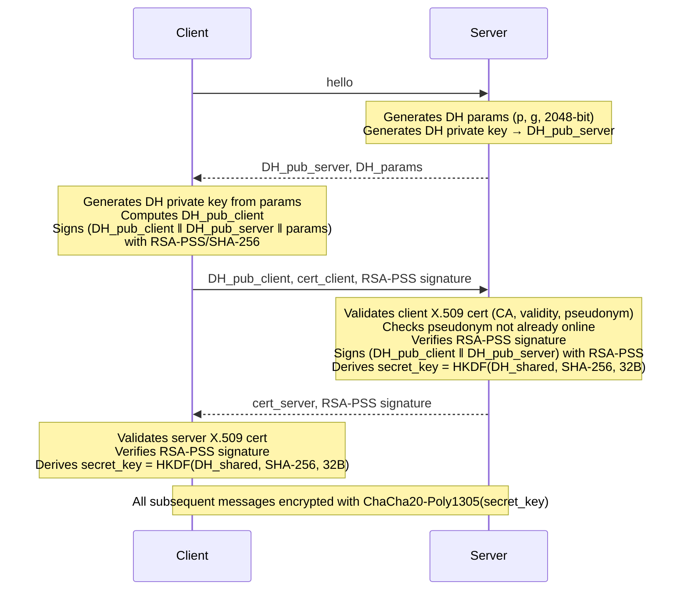

# Secure File Vault System

> A cryptographically secure, multi-client file storage and sharing service built with Python — featuring mutual authentication via X.509 certificates, an authenticated Diffie-Hellman key exchange (Station-to-Station protocol), end-to-end file encryption, and fine-grained access control for both personal and group vaults.

---

## Overview

This project implements a **secure vault service** that allows members of an organization to store and share files with strong guarantees of **authenticity**, **integrity**, and **confidentiality**. Every byte transmitted between clients and the server is encrypted and authenticated; every identity is verified by a Certificate Authority before a session is established.

The system supports two types of vaults:
- **Personal vaults** — private storage owned by a single user, with the ability to share individual files with specific permissions.
- **Group vaults** — shared storage spaces where group members can collaboratively upload and access files, each encrypted separately for every group member.

---

## Security Architecture

This is the core of the project. The cryptographic design follows industry-standard patterns.

### Authenticated Key Exchange — Station-to-Station (STS) Protocol

Before any data is exchanged, the client and server perform a **mutually authenticated Diffie-Hellman handshake**:



### File Encryption — Envelope Encryption

Files are never stored or transmitted in plaintext. A **per-file symmetric key** (`k_file`) is generated for each upload:

1. The file content is encrypted with **ChaCha20-Poly1305** using a random `k_file` and a random 12-byte nonce.
2. `k_file` is encrypted with **RSA-OAEP/SHA-256** using the recipient's public key (extracted from their X.509 certificate).
3. The encrypted file and the encrypted `k_file` are bundled and sent over the already-encrypted channel.

For group files, `k_file` is independently encrypted for **each group member's public key**, so every member can decrypt it with their own private key — without the server ever having access to the plaintext.

### Cryptographic Primitives Summary

| Primitive | Usage |
|---|---|
| **Diffie-Hellman (2048-bit)** | Ephemeral session key agreement |
| **RSA-PSS / SHA-256** | Digital signatures during STS handshake |
| **HKDF / SHA-256** | Key derivation from raw DH shared secret |
| **ChaCha20-Poly1305** | AEAD encryption of all channel messages |
| **RSA-OAEP / SHA-256** | Asymmetric encryption of per-file symmetric keys |
| **X.509 certificates** | Identity and public key binding |
| **PKCS#12 keystores** | Secure storage of private keys and certificate chains |
| **BSON** | Compact binary serialization of structured protocol messages |

### Certificate Validation

Every certificate is validated against a **custom Certificate Authority (VAULT_CA)** before any session is established. Validation checks:
- CA subject attributes (`OU = "SSI VAULT SERVICE"`, `PSEUDONYM = "VAULT_CA"`)
- Certificate signature issued by the CA
- Certificate validity period (not-before / not-after)
- Subject pseudonym format: `VAULT_SERVER` for the server, `VAULT_CLI{N}` for clients

Any failure immediately terminates the connection.

### Session Management

The server tracks active sessions in `active_users.json`. A client whose pseudonym is already registered as online is **refused a second connection**, preventing session hijacking via certificate replay. All activity is recorded in a server-side audit log.

---

## Features

### Personal Vault
- Upload files with automatic client-side encryption
- Read files — the server sends the encrypted file and the RSA-encrypted key; decryption happens entirely on the client
- Delete files (removes access for all users the file was shared with)
- Replace file content while preserving the file ID and shared access
- View file details: name, owner, list of users with access and their permissions
- Share files with specific users with `R` (read) or `W` (write) permissions
- Revoke access for a specific user

### Group Vault
- Create named groups (owner gets full control)
- Add files to a group vault — the file key is encrypted separately for each current group member
- Add new users to a group with granular permissions — the group admin re-encrypts all group file keys for the new member
- Remove users from a group
- List all groups the current user belongs to, along with permissions
- Delete a group entirely
- List all files within a group

### Infrastructure
- Concurrent multi-client async TCP server (`asyncio`)
- Graceful server shutdown with cleanup of all encrypted files and state
- Server-side audit log of all operations

---

## Project Structure

```
.
├── projCA/
│   ├── VAULT_CA.crt          # Certificate Authority certificate
│   ├── VAULT_SERVER.p12      # Server PKCS#12 keystore
│   ├── VAULT_CLI1.p12        # Client 1 keystore
│   ├── VAULT_CLI2.p12        # Client 2 keystore
│   └── VAULT_CLI3.p12        # Client 3 keystore
│
├── scripts/
│   ├── Server.py             # Async TCP server; per-connection workers; STS handshake
│   ├── Client.py             # Async TCP client; interactive CLI; STS handshake
│   ├── client_functions.py   # Client-side crypto: file encryption, message construction
│   ├── server_functions.py   # Server-side business logic: vault management, access control
│   ├── certificados.py       # X.509 certificate loading, validation, pseudonym extraction
│   ├── ficheiro.py           # File I/O, session state, logging, certificate registry
│   └── utils.py              # Binary message framing (mkpair / unpair) and crypto helpers
│
├── file_test/
│   └── file_test{1..6}.txt   # Sample plaintext files for testing
│
└── Proj/
    └── Relatorio.md          # Full technical project report (Portuguese)
```

---

## Prerequisites

- Python 3.10+
- Install dependencies:

```bash
pip install cryptography pymongo bson
```

---

## Running the System

### 1. Start the Server

The server requires a PKCS#12 keystore containing its private key and certificate chain.

```bash
cd scripts
python3 Server.py VAULT_SERVER.p12
```

The server listens on `127.0.0.1:7777`. To shut it down cleanly, type `exit` in the server terminal — this will terminate all connections and remove all encrypted state files.

### 2. Connect a Client

Each client identifies itself with its own PKCS#12 keystore. Multiple clients can connect simultaneously.

```bash
# Connect as client 1 (default if no argument given)
python3 Client.py VAULT_CLI1.p12

# Connect as client 2
python3 Client.py VAULT_CLI2.p12
```

Upon connection, the STS handshake runs automatically. Once complete, the client enters an interactive command prompt.

---

## CLI Command Reference

All commands are sent over the encrypted channel established during the handshake.

### Personal Vault

| Command | Description |
|---|---|
| `add <file-path>` | Encrypt and upload a file to your personal vault. Returns the server-assigned file ID. |
| `read <file-id>` | Download and decrypt a file, printing its contents. |
| `delete <file-id>` | Permanently delete a file and revoke access for all users it was shared with. |
| `replace <file-id> <file-path>` | Replace the content of an existing file. Requires write permission if the file was shared with you. |
| `details <file-id>` | Show the file name, owner, and the list of users with access and their permissions. |
| `share <file-id> <user-id> <permission>` | Share a file from your personal vault. `permission` is `R` (read) or `W` (write). |
| `revoke <file-id> <user-id>` | Remove a user's access to one of your files. |
| `list -u <user-id>` | List all files accessible by a given user. |

### Group Vault

| Command | Description |
|---|---|
| `group create <group-name>` | Create a new group. Returns the server-assigned group ID. |
| `group delete <group-id>` | Delete a group and all its associated files. Only the group owner can do this. |
| `group list` | List all groups you belong to, along with your permissions in each. |
| `group add <group-id> <file-path>` | Encrypt and upload a file to a group vault. The file key is re-encrypted for every group member. |
| `group add-user <group-id> <user-id> <permissions>` | Add a user to a group. All existing group file keys are re-encrypted for the new member. |
| `group delete-user <group-id> <user-id>` | Remove a user from a group. |
| `list -g <group-id>` | List all files stored in a specific group vault. |

### Session

| Command | Description |
|---|---|
| `exit` | Gracefully close the connection to the server. |

---

## Author

Developed by **Gonçalo Oliveira Cruz** as part of the **Information Systems Security** course at the [University of Minho](https://www.uminho.pt/), academic year 2024/25.